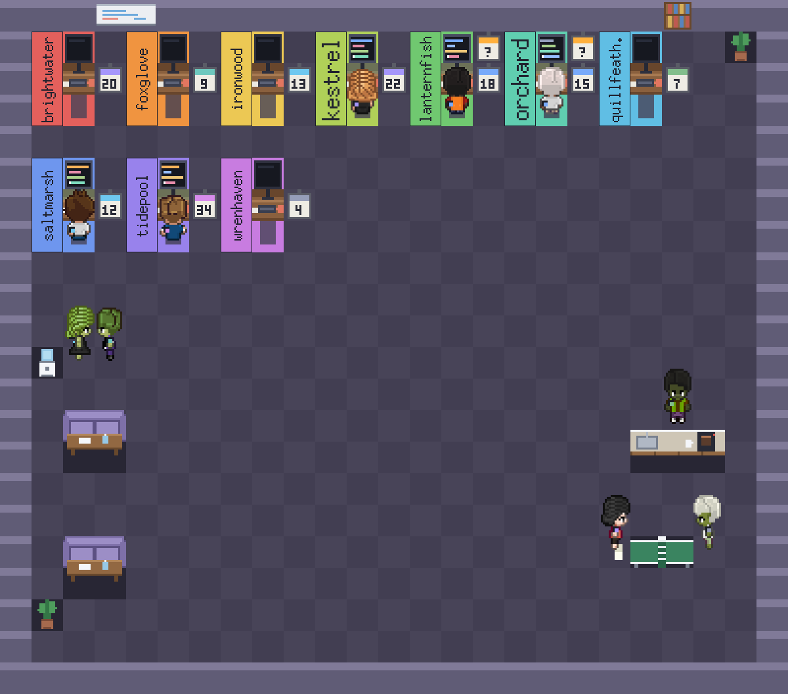
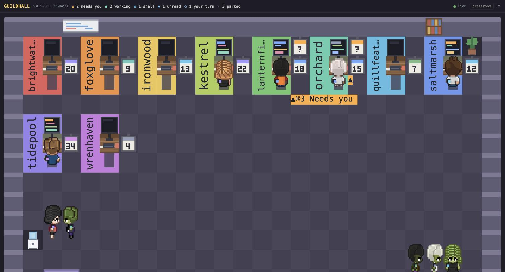
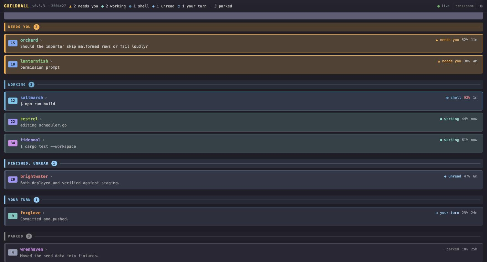

<h1 align="center">guildhall</h1>

<p align="center"><strong>Nine Claude Code sessions are running. Three are waiting on you.<br>You have no idea which three.</strong></p>

<p align="center">
  <sub>Every live session as a character in a pixel office — working ones at their desks, blocked ones holding a placard.<br>In your terminal, and on your phone. Reads what Claude Code already writes; installs nothing.</sub>
</p>

<p align="center">
  <a href="LICENSE"></a>
  
  
  <a href="#seeing-it-from-another-machine"></a>
</p>

<p align="center">
  
</p>

Sessions that are working sit at their desks with a lit screen. Sessions waiting
on you get a placard. Everyone else walks around, gets coffee, plays ping-pong.
Below the room, a table with the detail: what each session is doing, how much
context it has left, and how long it has been ignored. A project's color is the
same in both halves, so a character you notice upstairs is one color-match away
from its row.


Sprites need a terminal that speaks the kitty graphics protocol — Ghostty, kitty,
WezTerm. Anywhere else the room falls back to half blocks and everything else is
unchanged.

It is **read-only by default**. It watches the sessions you already run — in
cmux or anywhere else — and never starts, stops, or moves one. The only thing it
writes is a "focus this tab" request to cmux, and only when you press enter.
There is one exception, off unless you turn it on: see *Typing into a session
from somewhere else* below.

### Try it

```
git clone https://github.com/anthonybo/guildhall && cd guildhall
npm install
npm start
```

That is the whole of it if you only want the room in a terminal. Nothing below is
required to use it.

### Set it up properly, on a Mac

One command, from the checkout, instead of the eight steps it replaces:

```
npm run install:mac
```

It puts `guildhall` on your PATH, installs the browser view as a service that
starts at login, builds and installs the menu bar app, and turns on this
repository's commit gates. It reports each part and whether it actually came up.

The gates are worth a sentence, because git will not do it for you:
`core.hooksPath` is repository-local and is not carried across a clone, so a fresh
checkout starts with no pre-commit checks — including the one that refuses to
commit or push anything private. `npm run install:mac` switches them on; if you are
not using it, run `npm run hooks` once per clone. Then choose a passcode, which it deliberately
does not invent for you:

```
guildhall            # press ? for the panel, then p for the passcode
```

The room is optional from here on. Quit it and the browser view carries on,
because that is a service now.

### Upgrading, on any machine

```
guildhall --upgrade
```

Pulls, rebuilds, reinstalls both services and reloads them, from any directory.
It stops rather than guessing if the pull cannot fast-forward — an upgrade has no
business merging or rebasing on your behalf.

### Or by hand

Just the command on your PATH, without the services:

```
npm link                    # from the project, once
guildhall                   # the room, from any directory
guildhall --help            # everything it can do
```

`npm link` also builds the bundle, which is what `guildhall` runs — measured at
0.15s to start against 0.49s through the TypeScript loader, and a third of a
second is worth noticing on a program you open to glance at something.

Nothing is installed into Claude Code. No hooks, no settings file is edited, no
wrapper around your terminal — it reads the registry and transcripts Claude Code
already writes, which is why it sees sessions you started anywhere.

## What it does

| | |
| --- | --- |
| **The room** | Every live session as a character. Working sessions sit at a lit desk; ones waiting on you get a placard; the rest get coffee. |
| **The table** | What each session is doing, context left, how long it has been ignored. |
| **[The browser view](#seeing-it-from-another-machine)** | The same room and list on your phone or another computer, behind a passcode. Off by default — `s`. |
| **[The live terminal](#typing-into-a-session-from-somewhere-else)** | Open a session's real terminal from the browser, read it, and type into it. Off by default, and behind a second password. |
| **[pressroom](#commits-and-deploys)** | What has been committed, pushed, built and deployed, across every repo. |
| **[Keeping the machine awake](#keeping-the-machine-awake)** | Hold off sleep while sessions are working, so a long job survives you walking away. |

## Keys

| key | |
| --- | --- |
| `↑` `↓` | move the selection |
| `⏎` | jump to that session's cmux tab |
| `f` | show only sessions that need you |
| `l` | all labels, or only the ones that need you |
| `a` | keep the machine awake, or let it sleep |
| `tab` | cycle room / split / table |
| `?` | what everything on screen means |
| `r` | force a redraw |
| `q` | quit |

`--no-awake` starts with the sleep hold off. `--once` prints a single frame and
exits. `--demo` runs against a fictional office, which is handy for seeing what
this looks like before you have anything running.

It reflows rather than truncating. Identity is never the thing that goes: the
context gauge yields first, then the project name narrows, so a row always tells
you *which* session it is.


Press `?` for a panel explaining every status, what the sleep hold does and does
not promise, what a level counts, and how to read the room. Any key closes it.

## What it reads

Nothing is installed and no session is instrumented. Three sources, all already
on disk:

- `~/.claude/sessions/<pid>.json` — one registry entry per running process
- `~/.claude/projects/<slug>/<sessionId>.jsonl` — the session transcript
- cmux's window layout, for the tab to jump to

None of those three are documented interfaces, so all of them may change. The
registry has a supported replacement — `claude agents --json` — and guildhall
falls back to it whenever the directory comes back empty, which is the shape
that failure takes: the path moved, or the schema changed and every entry was
discarded. It is the fallback rather than the primary for a measured reason: the
CLI costs ~730ms per call against ~0.6ms to read the directory, and the room
polls every two seconds. The lookup runs in the background and never blocks a
frame, so the cost of the registry breaking is that sessions appear one poll
late. The transcript has no supported equivalent, and everything interesting —
what a session is doing, its context use, its level — comes from there.

## Two things worth knowing

**Status is derived, not reported.** Claude Code writes `busy` on state *change*,
never as a heartbeat, so a session killed mid-turn stays `busy` forever — and a
session that ended its turn on a question reports `idle` even though it is
waiting on you. Guildhall decides whose turn it is from the registry and the
transcript together. See `src/data/state.ts`.

**Levels measure work, not time.** `XP = 25·commits + 3·edits + 15·subagents +
minutes worked`, on an `n³/3` curve. Minutes come from summed turn durations, so
a session left open overnight scores nothing for it. Commits are weighted highest
but cannot be the base — if you gate commits behind approval, your busiest
sessions will have none. The curve is anchored to a measured accumulation rate
(~572 XP/day for the heaviest session observed), which puts a month of hard work
at level 37 and a year at 85. See `src/data/score.ts`.

## Keeping the machine awake

While any session is mid-task, guildhall holds a power assertion
(`caffeinate -dims`) so a long build is not lost to a sleeping laptop. It lets go
when the last one stops.

It is **conditional, not a permanent hold**. Enabled means "do not sleep while
something is working", not "never sleep" — with nothing running, your machine
sleeps on its normal schedule. The header says which of the three you are in:

| | |
| --- | --- |
| `● holding awake · work in progress` | something is working, sleep blocked |
| `◐ awake when working · idle, may sleep` | enabled, nothing running, free to sleep |
| `○ sleeps normally · never held` | disabled |

The screen is held on as well as the machine. That was not the original
behavior, and leaving it out was a mistake worth naming: `displaysleep` is
commonly two minutes on battery and the screen lock is commonly immediate, so
the machine stayed up exactly as promised while the display blanked and
locked — which is indistinguishable from the feature not working. Set
`"awakeDisplay": false` in the config file to let the screen sleep on its own
and keep the battery.

One limit remains: **closing the lid still sleeps the machine**, which no power
assertion can override.

Sessions *waiting on you* deliberately do not qualify. Holding the machine open
for a session that is waiting on a human would mean never sleeping again.

Press `a` to arm or disarm it at any time; disarming releases the assertion
immediately. The header shows which of the three states you are in — holding,
armed but idle, or off. Start with `--no-awake` to have it off from the outset.

**The catch:** the room only protects the machine while it is running, which is
the wrong shape for the job — a build runs longest exactly when nobody is
watching a dashboard. `guildhall --guard` is the headless version: same polling
and the same assertion, no rendering, logging each transition.

```
guildhall --guard
2026-08-07 07:56:10  guildhall guard started (pid 1234)
2026-08-07 07:56:10  holding sleep off — orchard, saltmarsh
2026-08-07 08:14:02  released
```

To have it always on, install it as a launch agent:

```
cp contrib/dev.guildhall.guard.plist ~/Library/LaunchAgents/
# edit the two paths inside, then
launchctl load ~/Library/LaunchAgents/dev.guildhall.guard.plist
```

Unlike the room, the guard does not exit when no sessions are live — a machine
with nothing running now is exactly the one that will have something running in
ten minutes.

## Seeing it from another machine

`s` starts a small read-only web server so your other computers and your phone
can watch the same room. It is **off by default** and the choice is remembered.

```
guildhall --serve          # or press s while it is running
```

The browser runs the same office — same planner, same seating, same behavior —
against a JSON feed, so it cannot drift from the terminal. On a phone the room is
hidden and the list carries everything; the office at 100 columns is a smear on a
5-inch screen, and "what is the status" is the question a phone is asking.



Underneath it, the same list the terminal shows, grouped by who needs you first.



*Both are `--demo`: every project name and sentence above is invented, so the
images never carry anyone's real work.*

It answers on your local network and on any VPN interface. Binding to `0.0.0.0`
already covers a Tailscale address, so LAN today and a tailnet later is the same
server with nothing to change. It is never on the public internet.

**When the machine sleeps, the page says so.** The server lives on the machine
being watched, so a laptop that sleeps once its work finishes takes the feed with
it. The page keeps the last numbers, dims them, and names their age — *"this is
how it looked 40 minutes ago"* — rather than presenting hours-old state as
current, which is the one thing a status page must never do. It reconnects by
itself when the machine wakes; no refresh, no logging in again.

There is nothing to fix beyond that, because a sleeping machine genuinely has
nothing to report: every session is idle by definition. If you want it reachable
around the clock, keep the machine awake in System Settings or run the server
somewhere that never sleeps. `--guard` will not do it — it holds sleep off only
while something is *working*, which is exactly the window that has already closed.

Access needs a four-digit passcode, typed into the page. Press `?` in the
terminal to see the address and the code. It is asked once per device and then
remembered as a session cookie — the code itself is never put in a URL, so it
cannot end up in browser history, a shared link, or a proxy log.

Four digits is ten thousand combinations, which a script would try in under a
second, so the code is not the security — the throttle is. Five wrong answers
from one address and it stops answering, doubling each time up to half an hour.
That turns an exhaustive search from seconds into months. Change the code in
`~/.config/guildhall/passcode`.

**Anyone who gets in can read session titles, the last thing each session said,
filenames being edited and commands that were run** — which is the reason it is
off unless you ask for it.

With control off, nothing it serves can change anything. There is no endpoint that writes, on this
machine or in any session, so the worst case of leaving it on is disclosure, not
damage.

### Leaving it running — the browser view without a terminal

The room and the server started life together, which tied the browser view to a
terminal window somebody had to leave open. `--headless` is that view on its own:
it serves, holds sleep off while sessions work, and draws nothing at all.

```
guildhall --headless
2026-08-19 15:39:06  guildhall headless on 0.0.0.0:4318 (pid 1234) — 0.6.0
```

Run it at login so it survives a reboot, which is the point — a phone checking on
the machine should not depend on whether you happened to leave a terminal open:

```
cp contrib/dev.guildhall.headless.plist ~/Library/LaunchAgents/
# edit the two paths inside first — `which node` prints the one you need
launchctl load ~/Library/LaunchAgents/dev.guildhall.headless.plist
```

It is up when this answers `401`, which is the passcode gate rather than a
failure:

```
curl -s -o /dev/null -w '%{http_code}\n' http://127.0.0.1:4318/
```

Two things to get right. **Use the absolute path to `node`** in the plist:
launchd starts with almost no environment, so nvm's PATH does not exist and a
linked `guildhall` is not on it. And **do not run this and `--guard` together** —
headless already holds sleep off, so the pair would poll the same registry twice
and assert the same thing.

The room is then optional. Open `guildhall` in a terminal when you want to watch
it, quit it when you do not, and the browser view carries on either way.

### The menu bar

`npm run install:mac` also builds a small macOS menu bar app, so the answer to
"does anything need me" is a glance at the top of the screen rather than opening
anything.


The icon carries the state, and the shape changes with the color so it does not
depend on color vision:

| | |
|---|---|
| **green** filled hall, with a count | that many sessions are working |
| **orange** warning triangle, with a count | that many are waiting on you |
| plain hall, no count | everything is idle or finished |
| plain hall and a dash | the service is not answering |

Clicking it lists every session grouped by project, foldable, with what each one
is doing, how full its context window is, and its cmux tab — click a row to bring
that terminal to the front. Underneath, the plan's five-hour and weekly quota and
what today has cost, read from Anthropic's usage endpoint and `ccusage` and cached
so the numbers cost nothing to look at.

Settings changes the port, the passcode, whether the browser may type into
sessions, the screen hold and the label placement, and can start, stop or restart
the service — everything the terminal's `?` panel can do. It sets the control
password too, by handing it to guildhall on stdin rather than hashing it itself,
so there is one implementation of storing that credential.

It needs Xcode to build, is not code-signed, and therefore runs on the machine
that built it — which is why the installer builds it rather than shipping a binary.
Quitting the icon does not stop the browser view; they are separate services.

```
launchctl bootout gui/$(id -u)/dev.guildhall.bar   # stop the icon coming back
```

### Reaching it from anywhere — Tailscale

On your own network the address from `?` is enough. To reach it from a phone on
mobile data, put both machines on a [tailnet](https://tailscale.com/) — nothing in
guildhall changes, because binding to `0.0.0.0` already answers on every interface
the machine has.

```
brew install --cask tailscale     # then sign in on the Mac and on the phone
tailscale ip -4                   # the 100.x.y.z address to use
```

Open `http://100.x.y.z:4318` on the phone and enter the passcode. The traffic is
encrypted by Tailscale and the machine is never exposed to the public internet —
which is also why **control is refused on a plain LAN**: a shared secret on a
network you hand to guests is not a boundary.

Add it to your phone's home screen and it opens like an app, without browser
chrome.

## Commits and deploys

The **pressroom** button in the browser header opens what has actually shipped:
one dense line per repository — branch, commits ahead of the upstream, dirty
files, whether the pipeline passed, whether it is live — and a feed of commits,
pushes, workflow runs and deploys underneath.

`↑3` is the line that earns its place. Every project here deploys by pushing, so
three commits ahead of the upstream is three commits of work that exist on this
laptop and nowhere else.

It reads [pressroom](https://github.com/anthonybo/pressroom), which is a separate
program — guildhall watches sessions, pressroom watches repositories, and the two
answer different questions. Install it and the panel fills; leave it out and the
panel says so rather than sitting empty.

```
cd ~/projects/pressroom && npm link
```

The local half is git only and takes about two seconds. Workflow runs and
Cloudflare deploys take about seventeen, because every Worker repo spawns its own
wrangler, so they are fetched only when you ask — the toggle is remembered.

## Requirements

- Node 20+
- macOS for the two optional integrations. Both degrade rather than fail: without
  cmux you lose tab-jumping and unread marks, and the sleep hold is a no-op off
  macOS. The room, the table and the scoring work anywhere Claude Code does.
  Set `GUILDHALL_CMUX` if your cmux binary is not in the usual place.
- A terminal implementing the kitty graphics protocol — Ghostty, kitty, or
  WezTerm — for the sprites. Anything else falls back to half-block rendering.
- Xcode, only for the menu bar app, because it is built on the machine that runs
  it rather than shipped as a binary — it is not code-signed, so a build from
  somewhere else would not run. `npm run install:mac` skips it with a message when
  there is no Swift toolchain, and everything else still installs.

## Layout

```
src/
  main.ts          driver: frame loop, input, image transport
  data.ts          joins registry + transcripts + cmux into Sessions
  data/            paths · registry · agents · transcript · digest · state · score · describe · cmux
  office.ts        Office — drawing and labels
  office/          model · plan (pure layout) · room (seats, paths) · sim (behavior)
  canvas.ts        half-block pixel canvas
  kitty.ts         graphics protocol, terminal reply demultiplexer
  characters.ts    sprite sheets
  screens.ts       generated monitors and level badges
  props.ts         generated furniture
  table.ts         the detail table
  theme.ts         palette, tiers
```

`npm test` runs the suite; `npm run check` adds the type check. `npm run dev`
runs from source without the build step.

## Documentation images

`npm run docs` regenerates everything in `docs/`, and `npm run release` does it
for you — so the picture cannot lag the program. `npm run check` fails if the
committed images no longer match what the code renders; they are byte-for-byte
deterministic, so any difference means the look changed and nobody regenerated. They are drawn
from the fictional office in `src/demo.ts`, so they are reproducible and contain
nobody's real project names or half-finished sentences.

`tools/shot.ts` composites the same layers the terminal does — the sprites,
workstations and level badges are kitty images and never touch the text grid, so
a plain ANSI capture shows only the half-block fallback, which looks like a
different program. The room is embedded as a raster and every label is real SVG
text on top, which keeps it readable at any zoom.

## Versioning

The header shows `version · commit`, e.g. `v0.2.0 · 616067a`. The commit is read
straight out of `.git` rather than by shelling out, and it is there to answer the
one question a version number cannot: *is the process I am looking at the one I
just built?* A dashboard you leave running for days will happily predate the
feature you are trying to use — which is exactly how a keep-awake can appear to
be running while the process is older than it.

To cut a release:

```
npm run release                              # patch
npm_config_level=minor npm run release       # minor
```

That runs the checks, bumps `package.json`, tags the commit, and pushes with the
tag — so the number and the tag cannot drift apart.

## Credits

Character sprites and the simulation model come from
[pixel-agents](https://github.com/pixel-agents-hq/pixel-agents) (MIT) — see
`assets/characters/LICENSE-pixel-agents.txt`. The room deviates from it in three
deliberate ways, each documented at the top of `src/office.ts`.

## Typing into a session from somewhere else

`"control": true` in the config lets the browser open a session's **real
terminal** — the one already on your screen, not a second copy — read what it is
showing, and type into it. It works through cmux's socket API: `terminal.replay`
to see the screen as a styled grid, and `terminal.input` to type. Press ⌨ on a row
to open it.

Text and the Enter that submits it travel in **one** call. They used to be two —
`send` then `send-key Enter` — and the gap between them was long enough to lose the
Enter, which put the message in Claude Code's prompt and left it sitting there.

Not `claude -p --resume`, which was the obvious alternative and is wrong for
this: it starts a *second* process against the same transcript, so you get two
writers on one conversation and nothing appears in the terminal you are actually
looking at.

**This is the one thing here that can change your machine**, and it is treated
that way. Anyone holding the control token can send text to Claude Code in every
repository you have open, which reaches editing files and running commands. So:

- **A separate credential.** A password you choose, not the four-digit view
  passcode. Watching and typing are different privileges, and a device trusted
  with one has not been trusted with the other. You set it on the machine —
  press `?` then `c` — because that is the trust boundary, and it is stored
  **scrypted**, so the file holds a hash rather than anything anyone can type.
  Eight characters minimum, and the throttle is what actually protects it: five
  wrong tries then a doubling wait, which works out at about 405 guesses a year.
  Eight lowercase letters is 2.1e11 combinations, so that is 260 million years
  to get halfway. The floor was twelve first, which was over-specified — long
  enough to be irritating to type on a phone, which is the one place this
  credential exists to be used. With no password set, control is closed
  rather than open.
- **Off unless you turn it on**, with its own switch independent of `serve`.
- **Loopback or tailnet only.** Never a plain LAN, whatever the config says. A
  shared secret on a network you also hand to guests is not a boundary, and no
  amount of token length fixes being reachable by every device on the subnet.
- **Permission prompts stay yours.** Keys that would answer one are refused, so
  a remote caller cannot approve its own tool use.
- **Every send is printed** above the footer on the machine's own screen. Acting
  here remotely is possible; doing it unseen is not.

The session must be in a cmux tab. Without one there is no terminal to address,
and guildhall refuses rather than guessing — a wrong guess types into another
project. Addressing is by cmux's workspace UUID, never its position: `workspace:2`
and the second tab are different things.
