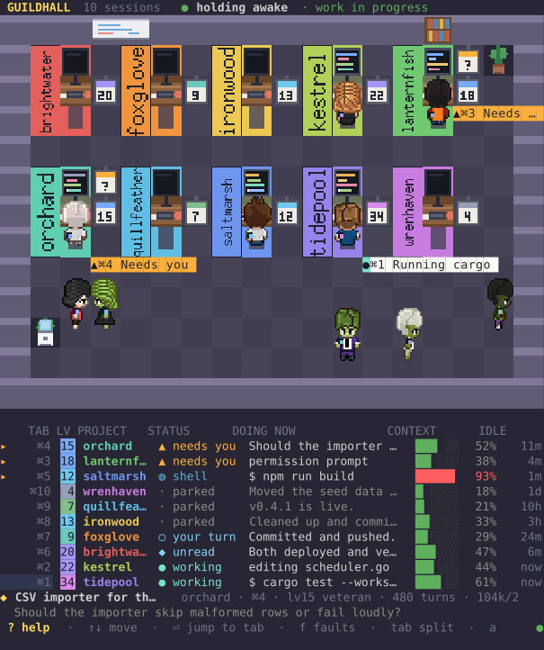

# guildhall

Every live Claude Code session as a pixel office, in your terminal.


Sessions that are working sit at their desks with a lit screen. Sessions waiting
on you get a placard. Everyone else walks around, gets coffee, plays ping-pong.
Below the room, a table with the detail: what each session is doing, how much
context it has left, and how long it has been ignored. A project's colour is the
same in both halves, so a character you notice upstairs is one colour-match away
from its row.

Sprites need a terminal that speaks the kitty graphics protocol — Ghostty, kitty,
WezTerm. Anywhere else the room falls back to half blocks and everything else is
unchanged.

It is **read-only**. It watches the sessions you already run — in cmux or
anywhere else — and never starts, stops, or moves one. The only thing it writes
is a "focus this tab" request to cmux, and only when you press enter.

```
npm install
npm start
```

## Keys

| key | |
| --- | --- |
| `↑` `↓` | move the selection |
| `⏎` | jump to that session's cmux tab |
| `f` | show only sessions that need you |
| `l` | all labels, or only the ones that need you |
| `a` | keep the machine awake, or let it sleep |
| `tab` | cycle room / split / table |
| `?` | what everything on screen means |
| `r` | force a redraw |
| `q` | quit |

`--no-awake` starts with the sleep hold off. `--once` prints a single frame and
exits. `--demo` runs against a fictional office, which is handy for seeing what
this looks like before you have anything running.

It reflows rather than truncating. Identity is never the thing that goes: the
context gauge yields first, then the project name narrows, so a row always tells
you *which* session it is.



Press `?` for a panel explaining every status, what the sleep hold does and does
not promise, what a level counts, and how to read the room. Any key closes it.

## What it reads

Nothing is installed and no session is instrumented. Three sources, all already
on disk:

- `~/.claude/sessions/<pid>.json` — one registry entry per running process
- `~/.claude/projects/<slug>/<sessionId>.jsonl` — the session transcript
- cmux's window layout, for the tab to jump to

None of those three are documented interfaces, so all of them may change. The
registry has a supported replacement — `claude agents --json` — and guildhall
falls back to it whenever the directory comes back empty, which is the shape
that failure takes: the path moved, or the schema changed and every entry was
discarded. It is the fallback rather than the primary for a measured reason: the
CLI costs ~730ms per call against ~0.6ms to read the directory, and the room
polls every two seconds. The lookup runs in the background and never blocks a
frame, so the cost of the registry breaking is that sessions appear one poll
late. The transcript has no supported equivalent, and everything interesting —
what a session is doing, its context use, its level — comes from there.

## Two things worth knowing

**Status is derived, not reported.** Claude Code writes `busy` on state *change*,
never as a heartbeat, so a session killed mid-turn stays `busy` forever — and a
session that ended its turn on a question reports `idle` even though it is
waiting on you. Guildhall decides whose turn it is from the registry and the
transcript together. See `src/data/state.ts`.

**Levels measure work, not time.** `XP = 25·commits + 3·edits + 15·subagents +
minutes worked`, on an `n³/3` curve. Minutes come from summed turn durations, so
a session left open overnight scores nothing for it. Commits are weighted highest
but cannot be the base — if you gate commits behind approval, your busiest
sessions will have none. The curve is anchored to a measured accumulation rate
(~572 XP/day for the heaviest session observed), which puts a month of hard work
at level 37 and a year at 85. See `src/data/score.ts`.

## Keeping the machine awake

While any session is mid-task, guildhall holds a power assertion
(`caffeinate -dims`) so a long build is not lost to a sleeping laptop. It lets go
when the last one stops.

It is **conditional, not a permanent hold**. Enabled means "do not sleep while
something is working", not "never sleep" — with nothing running, your machine
sleeps on its normal schedule. The header says which of the three you are in:

| | |
| --- | --- |
| `● holding awake · work in progress` | something is working, sleep blocked |
| `◐ awake when working · idle, may sleep` | enabled, nothing running, free to sleep |
| `○ sleeps normally · never held` | disabled |

The screen is held on as well as the machine. That was not the original
behaviour, and leaving it out was a mistake worth naming: `displaysleep` is
commonly two minutes on battery and the screen lock is commonly immediate, so
the machine stayed up exactly as promised while the display blanked and
locked — which is indistinguishable from the feature not working. Set
`"awakeDisplay": false` in the config file to let the screen sleep on its own
and keep the battery.

One limit remains: **closing the lid still sleeps the machine**, which no power
assertion can override.

Sessions *waiting on you* deliberately do not qualify. Holding the machine open
for a session that is waiting on a human would mean never sleeping again.

Press `a` to arm or disarm it at any time; disarming releases the assertion
immediately. The header shows which of the three states you are in — holding,
armed but idle, or off. Start with `--no-awake` to have it off from the outset.

**The catch:** the room only protects the machine while it is running, which is
the wrong shape for the job — a build runs longest exactly when nobody is
watching a dashboard. `guildhall --guard` is the headless version: same polling
and the same assertion, no rendering, logging each transition.

```
guildhall --guard
2026-08-07 07:56:10  guildhall guard started (pid 1234)
2026-08-07 07:56:10  holding sleep off — willow, quillfeather
2026-08-07 08:14:02  released
```

To have it always on, install it as a launch agent:

```
cp contrib/dev.guildhall.guard.plist ~/Library/LaunchAgents/
# edit the two paths inside, then
launchctl load ~/Library/LaunchAgents/dev.guildhall.guard.plist
```

Unlike the room, the guard does not exit when no sessions are live — a machine
with nothing running now is exactly the one that will have something running in
ten minutes.

## Seeing it from another machine

`s` starts a small read-only web server so your other computers and your phone
can watch the same room. It is **off by default** and the choice is remembered.

```
guildhall --serve          # or press s while it is running
```

The browser runs the same office — same planner, same seating, same behaviour —
against a JSON feed, so it cannot drift from the terminal. On a phone the room is
hidden and the list carries everything; the office at 100 columns is a smear on a
5-inch screen, and "what is the status" is the question a phone is asking.

It answers on your local network and on any VPN interface. Binding to `0.0.0.0`
already covers a Tailscale address, so LAN today and a tailnet later is the same
server with nothing to change. It is never on the public internet.

Access needs a four-digit passcode, typed into the page. Press `?` in the
terminal to see the address and the code. It is asked once per device and then
remembered as a session cookie — the code itself is never put in a URL, so it
cannot end up in browser history, a shared link, or a proxy log.

Four digits is ten thousand combinations, which a script would try in under a
second, so the code is not the security — the throttle is. Five wrong answers
from one address and it stops answering, doubling each time up to half an hour.
That turns an exhaustive search from seconds into months. Change the code in
`~/.config/guildhall/passcode`.

**Anyone who gets in can read session titles, the last thing each session said,
filenames being edited and commands that were run** — which is the reason it is
off unless you ask for it.

Nothing it serves can change anything. There is no endpoint that writes, on this
machine or in any session, so the worst case of leaving it on is disclosure, not
damage.

## Requirements

- Node 20+
- macOS for the two optional integrations. Both degrade rather than fail: without
  cmux you lose tab-jumping and unread marks, and the sleep hold is a no-op off
  macOS. The room, the table and the scoring work anywhere Claude Code does.
  Set `GUILDHALL_CMUX` if your cmux binary is not in the usual place.
- A terminal implementing the kitty graphics protocol — Ghostty, kitty, or
  WezTerm — for the sprites. Anything else falls back to half-block rendering.

## Layout

```
src/
  main.ts          driver: frame loop, input, image transport
  data.ts          joins registry + transcripts + cmux into Sessions
  data/            paths · registry · agents · transcript · digest · state · score · describe · cmux
  office.ts        Office — drawing and labels
  office/          model · plan (pure layout) · room (seats, paths) · sim (behaviour)
  canvas.ts        half-block pixel canvas
  kitty.ts         graphics protocol, terminal reply demultiplexer
  characters.ts    sprite sheets
  screens.ts       generated monitors and level badges
  props.ts         generated furniture
  table.ts         the detail table
  theme.ts         palette, tiers
```

`npm test` runs the suite; `npm run check` adds the type check. `npm run dev`
runs from source without the build step.

## Documentation images

`npm run docs` regenerates everything in `docs/`, and `npm run release` does it
for you — so the picture cannot lag the program. `npm run check` fails if the
committed images no longer match what the code renders; they are byte-for-byte
deterministic, so any difference means the look changed and nobody regenerated. They are drawn
from the fictional office in `src/demo.ts`, so they are reproducible and contain
nobody's real project names or half-finished sentences.

`tools/shot.ts` composites the same layers the terminal does — the sprites,
workstations and level badges are kitty images and never touch the text grid, so
a plain ANSI capture shows only the half-block fallback, which looks like a
different program. The room is embedded as a raster and every label is real SVG
text on top, which keeps it readable at any zoom.

## Versioning

The header shows `version · commit`, e.g. `v0.2.0 · 616067a`. The commit is read
straight out of `.git` rather than by shelling out, and it is there to answer the
one question a version number cannot: *is the process I am looking at the one I
just built?* A dashboard you leave running for days will happily predate the
feature you are trying to use — which is exactly how a keep-awake can appear to
be running while the process is older than it.

To cut a release:

```
npm run release                              # patch
npm_config_level=minor npm run release       # minor
```

That runs the checks, bumps `package.json`, tags the commit, and pushes with the
tag — so the number and the tag cannot drift apart.

## Credits

Character sprites and the simulation model come from
[pixel-agents](https://github.com/pixel-agents-hq/pixel-agents) (MIT) — see
`assets/characters/LICENSE-pixel-agents.txt`. The room deviates from it in three
deliberate ways, each documented at the top of `src/office.ts`.
